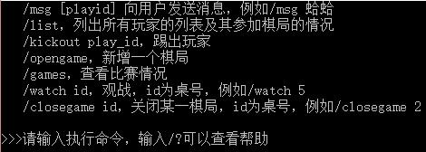
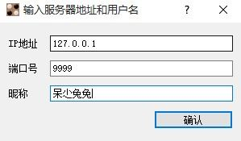
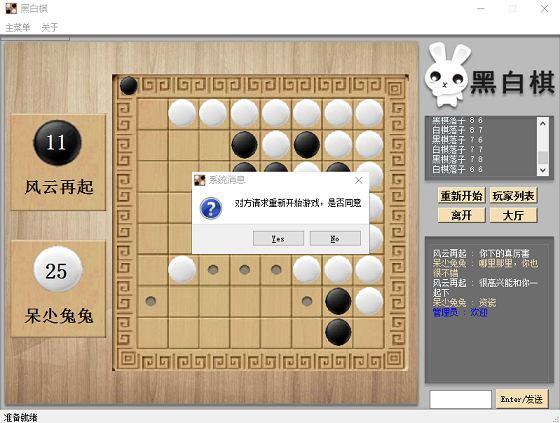

# 网络编程之黑白棋 v1.0
## 1.开发环境
- [ ] python版本 python 3.4
- [ ] 图形 pyqt5
- [ ] 打包 py2exe
- [ ] 网络 socket
- [ ] 多线程支持 threading

## 2.GobangServer（服务方）程序
&#160;&#160;&#160;&#160;服务器除了支持这些命令，最好在用户游戏的过程中，要能判断何时游戏结束，胜负如何。
> * /msg [playerid] 群发和向指定用户发送消息，用以某些提示。 
> * /list 列出所有玩家的列表及其参加棋局的情况。
> * /kickout playerid 将某玩家踢出游戏，向双方发送消息。
> * /opengame  gameName 开通新的棋局。 
> * /games 列出当前正在比赛的棋局。 
> * /watch gameName 可以观看某一棋局的比赛情况。
> * /closegame gameName 关闭某一棋局。

## 3.GobangClient（客户方）程序
&#160;&#160;&#160;&#160;该黑白棋游戏客户方程序要求能够支持如下命令（所有命令以/开始）和服务方程序交互：
> * /login playername 用playername登录服务器。
> * /games 列出当前正在比赛的棋局。
> * /list 列出服务器的当前所有玩家列表，及其参加棋局的情况。
> * /join gameName 加入某一棋局，对方玩家收到其加入的消息。
> * /move x y 通知服务器及对方玩家的走棋情况。
> * /restart 发出请求，如对方玩家同意后，重新开始游戏。
> * /leave 离开游戏。该棋局的对方玩家收到其离开的消息。

## 4.运行方法

### 4.1 命令行方法
* 启动服务器：python UdpServer.py 
* 启动客户端：python UdpClient.py

### 4.2 打包为exe文件
* 打包服务器：python py2exe_server.py
* 打包客户端：python py2exe_client.py
注：客户端使用了图形界面库pyqt5，需将使用到的dll文件、style.css、images\文件复制到exe文件目录下。结构如下图所示：
```
---UdpClient/
   |--imageformats/
           |--qjpeg.dll
   |--images/
           |--省略图片，源代码中的images/
   |--platforms
           |--qwindows.dll
   |--icudt53.dll
   |--icuin53.dll
   |--icuuc53.dll
   |--Qt5Core.dll
   |--Qt5Gui.dll
   |--Qt5Widgets.dll
   |--style.css
   |--UdpClient.exe
```
### 4.3运行截图

* 服务器



* 客户端




